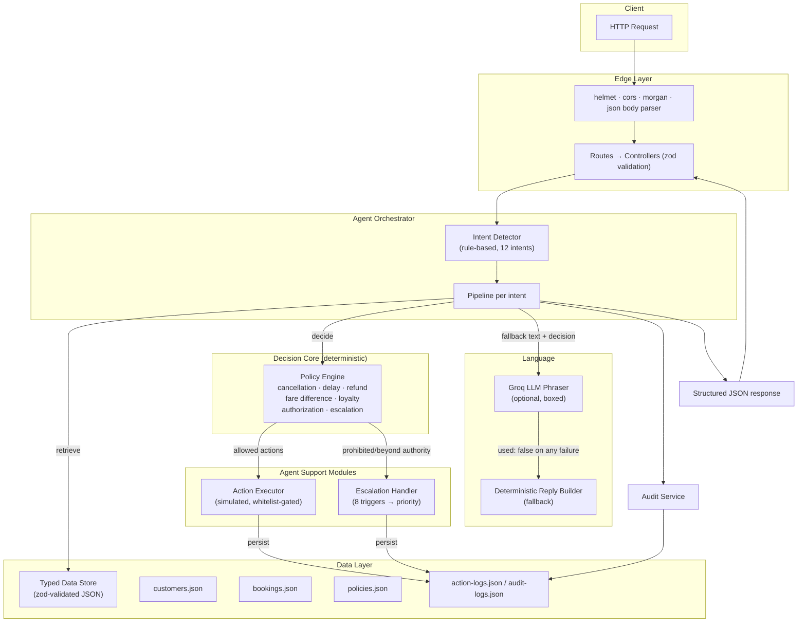

# ✈️ Airline Customer-Facing Resolution Agent — Backend

A production-structured Express + TypeScript backend for an AI-powered airline customer-support agent. Customers describe a disruption in natural language; the backend identifies them, detects intent, makes **deterministic** policy decisions, executes allowed actions, escalates what it must not decide, and audits everything.

> **Core principle:** the LLM is a *phraser*, never a *decider*. All eligibility, compensation, and authorization decisions come from a deterministic policy engine built strictly on the supplied assignment rules.

---

## 1. Project Overview

| | |
|---|---|
| **Domain** | Airline disruption support (cancellations, delays, refunds, rebooking) |
| **Interface** | REST API only — no frontend in this repository |
| **LLM** | Groq (`groq-sdk`), optional — the system is fully functional without it |
| **Data** | Fixed seed dataset: 3 customers, 4 bookings, policy documents |
| **Persistence** | JSON files (`action-logs.json`, `audit-logs.json`) — deliberately simple |
| **Status** | Assessment-ready: all test suites pass, build verified |

## 2. Assignment Objective

Build the backend for a customer-facing resolution agent that can:

1. Recognize a customer by PNR from natural conversation.
2. Understand what they are asking for (refund, hotel, waiver, status…).
3. Decide — **deterministically** — what policy entitles them to.
4. Execute only the allowed actions, simulated (no real airline systems).
5. Escalate anything prohibited or beyond authority to a human.
6. Audit every decision and action.
7. Reply in empathetic natural language (LLM), with a deterministic fallback when no LLM is available.

## 3. Architecture

Layered, unidirectional dependency flow. The policy engine is the single decision authority; the LLM sits at the edge and only rewords its output.



Key invariants:

- **One authority:** `src/agents/policy.engine.ts` decides eligibility. No other module may approve, waive, or compensate.
- **LLM is sandboxed:** it receives the final decision as its *only* source of truth and must preserve scope qualifiers ("delayed hours only", "original payment method", "within 24 hours"). Any failure (missing key, timeout, API error, empty reply) silently degrades to the deterministic reply.
- **Validation at every boundary:** JSON seed data is zod-validated at load; API inputs are zod-validated per request.

## 4. Folder Structure

```
.
├── scripts/
│   └── copy-data.js              # copies seed JSON into dist/ after tsc (build step)
├── src/
│   ├── agents/
│   │   ├── action.executor.ts    # simulated, policy-gated action execution
│   │   ├── agent.orchestrator.ts # full pipeline: intent → policy → action → audit → reply
│   │   ├── escalation.handler.ts # 8 escalation triggers → priority routing
│   │   ├── intent.detector.ts    # rule-based intent + entity extraction
│   │   └── policy.engine.ts      # ⚖️ deterministic decision authority (8 evaluators)
│   ├── config/
│   │   ├── constants.ts          # API prefix, limits, log formats
│   │   └── env.ts                # zod-validated environment config
│   ├── controllers/
│   │   ├── agent.controller.ts   # chat + action execution + escalation endpoints
│   │   ├── audit.controller.ts   # audit retrieval
│   │   ├── booking.controller.ts # booking lookups
│   │   ├── customer.controller.ts# customer lookups
│   │   └── policy.controller.ts  # policy documents
│   ├── data/
│   │   ├── action-logs.json      # executed-action log (runtime, append-only)
│   │   ├── audit-logs.json       # audit records (runtime, append-only)
│   │   ├── bookings.json         # 4 booking legs (seed, verbatim)
│   │   ├── customers.json        # 3 customers (seed, verbatim)
│   │   ├── policies.json         # policy documents (seed, verbatim)
│   │   ├── schemas.ts            # zod schemas pinned to the TS interfaces
│   │   └── store.ts              # typed loaders + append helpers
│   ├── middleware/
│   │   ├── error.middleware.ts   # AppError, 404, centralized error handler (arity-4)
│   │   └── validation.middleware.ts # shared zod schemas (PNR, chat, action, escalation)
│   ├── routes/
│   │   ├── action.routes.ts      escalation.routes.ts
│   │   ├── agent.routes.ts       audit.routes.ts
│   │   ├── booking.routes.ts     customer.routes.ts
│   │   ├── health.routes.ts      policy.routes.ts
│   ├── services/
│   │   ├── audit.service.ts      # createAuditRecord / getByPnr / getAll
│   │   ├── booking.service.ts    # booking lookups + disruption summaries
│   │   ├── customer.service.ts   # customer lookups + profiles
│   │   ├── llm.service.ts        # Groq phraser (never throws, always falls back)
│   │   └── policy.service.ts     # structured policy documents + source labels
│   ├── types/                    # 11 typed modules + barrel (index.ts)
│   ├── utils/
│   │   ├── strings.ts            # PNR/name normalization, list formatting
│   │   └── verify-*.ts           # 6 runnable test suites (see §Test Commands)
│   ├── app.ts                    # Express app assembly + route mounting
│   └── server.ts                 # HTTP server bootstrap, graceful shutdown
├── .env / .env.example           # secrets (env is git-ignored)
├── .gitignore
├── package.json
├── tsconfig.json                 # strict mode
└── README.md
```

## 5. Tech Stack

| Layer | Choice | Why |
|---|---|---|
| Runtime | Node.js + npm | assignment requirement |
| Framework | Express 5 | routing + middleware |
| Language | TypeScript (strict) | compile-time safety everywhere |
| Validation | zod | one schema language for env, seed data, and API input |
| LLM | `groq-sdk` (Groq) | fast inference; optional by design |
| Security | helmet, cors | headers + origin policy |
| Logging | morgan | HTTP request logs |
| IDs | `node:crypto.randomUUID()` | native UUIDv4; `uuid` retained per stack spec |
| Dev | tsx, typescript | instant dev loop, strict typecheck |

No database, no Redis, no Docker, no LangChain — intentionally excluded.

## 6. Data Model

Seed data is **verbatim from the assignment** — nothing invented, nothing extra. Customers are keyed by PNR (the only identifier supplied); bookings reference customers via `pnr`.

- **`Customer`** — name, loyalty tier (`Gold | Silver | Platinum`), pnr, email, phone, travel history (flights/12mo), previous complaints.
- **`Booking`** — discriminated union on `status`:
  - `CancelledBooking` — has `cancellationReason` (airline-caused iff `"Operational reasons"`),
  - `DelayedBooking` — has `delayHours`, `newDeparture`,
  - `UnaffectedBooking`.
  Because it's a union, `delayHours` is unreachable without narrowing — a compile-time guarantee that compensation logic handles every status.
- **`PolicyDocument`** — cancellation, delay tiers (3h/5h), refund (7 business days, original method), fare difference (₹1,500 waiver threshold), loyalty, 6 allowed actions, 5 prohibited rules.
- **`ActionLog` / `AuditRecord`** — runtime records with `id`, `timestamp`, `simulated: true` on actions.

## 7. Agent Workflow

```
User message
  ↓ Validate request (zod: pnr format, non-empty message)
  ↓ Detect customer / PNR        (from request or message text)
  ↓ Retrieve customer            (case-insensitive; 404 if unknown)
  ↓ Retrieve booking             (all legs for the PNR)
  ↓ Detect intent                (rule-based, 12 intents + entities: flight no, payment method, ₹ amounts)
  ↓ Retrieve relevant policy     (policy service, source-labeled)
  ↓ Run deterministic policy engine   ← THE ONLY DECISION POINT
  ↓ Check action authorization   (evaluateActionAuthorization gate)
  ↓ Execute allowed actions      (simulated, whitelisted, persisted)
  ↓ Create escalation if required (8 triggers → high/medium/low)
  ↓ Create audit record          (persisted, returns auditId)
  ↓ Generate natural-language response (Groq phraser, or deterministic fallback)
  ↓ Return structured JSON
```

## 8. Policy Engine Explanation

Every evaluator returns the exact contract:

```json
{
  "status": "eligible | partially_eligible | ineligible | escalation_required | clarification_required",
  "eligibleActions": [],
  "ineligibleActions": [],
  "requiresEscalation": false,
  "escalationReason": null,
  "policySources": [],
  "explanation": ""
}
```

Rules encoded exactly as supplied (thresholds read from validated policy data, not hardcoded literals):

| Rule | Implementation |
|---|---|
| Cancellation | Airline-caused ("Operational reasons") → free rebooking within 24 h **or** full refund. Any other cause → ineligible, no exceptions. |
| Delay < 3 h | ₹500 meal voucher |
| Delay > 3 h | voucher + lounge access |
| Delay > 5 h | voucher + lounge + hotel **for delayed hours only** |
| Boundaries | exactly 3 h is not "more than 3"; exactly 5 h is not "more than 5" (bands are cumulative: entitlements never decrease with delay length) |
| Refund | full refund, within 7 business days, **original payment method only**; different method → escalation |
| Fare difference | customer pays; waiver ≤ ₹1,500 grantable; **strictly above ₹1,500 → supervisor escalation** (₹1,500.00 exactly is not "above") |
| Loyalty | Gold/Platinum → priority rebooking **only**; never extra compensation |

## 9. Allowed Actions

`initiate_refund` · `request_rebooking` (within 24 h, airline-caused cancellation) · `issue_meal_voucher` · `issue_lounge_access` · `arrange_delayed_hours_hotel`

Plus two policy-implied non-executable outcomes the agent may *state*: `priority_rebooking` (Gold/Platinum) and waiver of fare difference **up to ₹1,500**.

## 10. Prohibited Actions

The agent never does any of these — enforcement is structural (whitelists) plus engine gates:

1. Compensation beyond policy
2. Waiving fare difference above ₹1,500
3. Exceptions for non-airline-caused disruptions
4. Legal/formal complaint handling without escalation
5. Refund to a different payment method

Additional hard guarantees: no invented flight availability (no inventory exists anywhere in the codebase — rebooking returns only the 24 h window), no invented customer data (services read only from the validated store), no unauthorized upgrades (loyalty yields priority rebooking only; upgrades route to fare-difference rules).

## 11. Escalation Logic

8 triggers, each mapped to a fixed priority:

| Trigger | Priority |
|---|---|
| Legal threats | high |
| Formal complaints | high |
| Unauthorized exceptions | high |
| Compensation beyond policy | medium |
| Fare waiver above ₹1,500 | medium |
| Refund to different payment method | medium |
| Missing authority | medium |
| Unclear requests requiring human review | low |

Escalations never suppress already-granted remedies — if a delay entitlement was executed and a waiver also needs a supervisor, the response reports both. Escalations are persisted in the audit trail.

## 12. API Endpoints

Uniform envelope: `{ "success": true, "data": … }` or `{ "success": false, "error": { "code", "message", "issues?" } }`. No stack traces in responses.

| Method | Endpoint | Description | Codes |
|---|---|---|---|
| GET | `/api/health` | liveness + LLM availability | 200 |
| GET | `/api/customers` | all customers | 200 |
| GET | `/api/customers/:pnr` | customer profile | 200/400/404 |
| GET | `/api/customers/:pnr/bookings` | customer + their bookings | 200/400/404 |
| GET | `/api/bookings/:pnr` | all booking legs for PNR | 200/400/404 |
| GET | `/api/bookings/:pnr/status` | disruption summary per leg | 200/400/404 |
| GET | `/api/policies` | all policy documents + source labels | 200 |
| POST | `/api/agent/chat` | main agent conversation | 200/400/404 |
| GET | `/api/agent` | agent metadata + LLM status | 200 |
| GET | `/api/audit` | all audit records (`?pnr=` optional filter) | 200/400 |
| GET | `/api/audit/:pnr` | audit records for one PNR | 200/400 |
| POST | `/api/actions/execute` | execute one allowed action (policy-gated) | 201/400/404 |
| POST | `/api/escalations` | file an escalation | 201/400 |

`POST /api/agent/chat` request/response:

```json
// request
{ "pnr": "TR1190B", "message": "My flight is delayed 4 hours and I need a hotel" }

// response
{
  "success": true,
  "data": {
    "message": "…natural language reply…",
    "intent": "hotel_request",
    "customer": { "name": "Arvind Kulkarni", "loyaltyTier": "Silver", "…": "…" },
    "booking": { "…": "…" },
    "policyUsed": ["Supplied Service Rules - Delay Compensation Rule", "…"],
    "decision": { "status": "partially_eligible", "eligibleActions": ["issue_meal_voucher", "issue_lounge_access"], "…": "…" },
    "actions": [{ "actionType": "issue_meal_voucher", "status": "completed", "…": "…" }],
    "escalation": null,
    "auditId": "uuid",
    "llmUsed": true
  }
}
```

## 13. Environment Setup

| Variable | Required | Default | Purpose |
|---|---|---|---|
| `PORT` | no | `5000` | HTTP port |
| `NODE_ENV` | no | `development` | `production` hides error details, uses combined logs |
| `GROQ_API_KEY` | no | — | enables LLM phrasing; omit for deterministic-only mode |
| `GROQ_MODEL` | no | `openai/gpt-oss-120b` | any Groq-hosted model id |
| `LLM_DISABLED` | no | — | set to `1` to force deterministic fallback (ops kill-switch, used by test suites) |

`.env` is git-ignored; `.env.example` is the template. No API keys exist anywhere in the codebase.

## 14. Installation

```bash
npm install
cp .env.example .env      # add GROQ_API_KEY if you want LLM phrasing
```

## 15. Running Locally

```bash
npm run dev               # tsx watch — hot reload (development)
npm run build             # tsc + copy seed JSON into dist/
npm start                 # node dist/server.js (production)
npm run typecheck         # tsc --noEmit
```

## 16. Example API Requests

```bash
# Health
curl http://localhost:5000/api/health

# Data lookups
curl http://localhost:5000/api/customers
curl http://localhost:5000/api/customers/SK4821X
curl http://localhost:5000/api/bookings/TR1190B/status
curl http://localhost:5000/api/policies

# Chat — Arvind's 4-hour delay
curl -X POST http://localhost:5000/api/agent/chat \
  -H "Content-Type: application/json" \
  -d '{"pnr":"TR1190B","message":"My flight is delayed 4 hours and I need a hotel"}'

# Direct action execution (policy-gated, simulated)
curl -X POST http://localhost:5000/api/actions/execute \
  -H "Content-Type: application/json" \
  -d '{"pnr":"WL7742","action":"arrange_delayed_hours_hotel","reason":"6h delay entitlement"}'

# Audit trail
curl http://localhost:5000/api/audit/WL7742
curl "http://localhost:5000/api/audit?pnr=SK4821X"
```

## 17. Three Mandatory Scenario Results

All verified through the live API (with LLM) **and** the deterministic test suites (without LLM).

**Priya Nair (Gold, SK4821X)** — *"My flight was cancelled. I want a full refund and free business class upgrade."*
→ intent `refund_request` → refund **initiated** (original payment method, within 7 business days), business-class upgrade **not approved** (fare difference is the customer's responsibility), Gold → priority rebooking only, cancellation recognized as airline-caused ("Operational reasons").

**Arvind Kulkarni (Silver, TR1190B)** — *"My flight is delayed 4 hours. I need hotel accommodation."*
→ intent `hotel_request` → 4-hour delay recognized; meal voucher **issued** (> 3 h), lounge access **issued**, hotel **refused** (threshold is strictly more than 5 hours), clear explanation given.

**Meher Kaur (Platinum, WL7742)** — *"My flight is delayed 6 hours. Give me a full-night hotel and waive the ₹2000 fare difference."*
→ intent `hotel_request` + waiver entity → 6-hour delay recognized; meal voucher **issued**, lounge access **issued**, **delayed-hours-only** hotel **arranged** (full-night hotel never authorized), **₹2,000 waiver escalated** to supervisor (above ₹1,500), Platinum → priority rebooking only.

## 18. Fallback Mode

The system is fully functional with **no API key**. The LLM service never throws — any failure (missing key, `LLM_DISABLED=1`, 10 s timeout, API error, empty reply) resolves to `used: false` and the orchestrator sends a deterministic, policy-complete reply built per intent. Every response carries an `llmUsed` flag so callers can see which path produced the text. All three mandatory scenarios pass in fallback mode; they are regression-tested that way (`LLM_DISABLED=1`).

## 19. Assumptions

- "Airline-caused" cancellation ≡ reason `"Operational reasons"` (the only value in the dataset).
- Fare-difference waiver: the agent may grant up to ₹1,500; anything strictly above needs a supervisor (per supplied rule).
- Hotel scope for >5 h delays is the delayed hours only; full-night stays are never authorized.
- PNR is the customer identifier; a PNR can hold multiple booking legs (Priya's outbound + return).
- Intent detection is keyword/rule-based (English); the LLM may later take over understanding behind the same interface.
- Rebooking does not pick an actual flight — no inventory exists, and policy forbids inventing one; it returns the 24 h free-rebooking entitlement.

## 20. Limitations

- **Simulated actions** — no real airline/PSS integrations; every executed action is marked `simulated: true`.
- **File-based persistence** (`action-logs.json`, `audit-logs.json`) — fine for an assessment; not built for concurrent production load. No database by design.
- **No authentication/authorization** on endpoints (assessment scope); no rate limiting.
- **Stateless chat** — each request is independent; the optional `history` field aids phrasing but there is no session store.
- **Static seed data** — 3 customers, 4 bookings; nothing else exists or can be added via API.
- **Keyword intent detection** — English-only; ambiguous phrasing may need a sentence or two from the user.
- **LLM output variance** — the phraser is temperature-0.3 and strictly constrained, but wording (not facts) can vary between runs; the decision block in the response is always deterministic.

## 21. AI Tools Used

This backend was built with the assistance of **Freebuff** (an AI coding agent powered by Z.ai's GLM model), used for scaffolding, implementation, test-suite authoring, and iterative debugging. All assignment data was entered verbatim from the supplied brief; all business rules were implemented as deterministic code and verified by the six test suites — the AI assistant did not invent policies, data, or endpoints beyond the specification.

---

## Test Commands

```bash
npm run verify:data       # seed JSON validates; counts: 3 customers, 4 bookings, all policies
npm run verify:services   # customer/booking/policy service contract checks
npm run verify:engine     # every rule + boundaries (3h/5h, ₹1,500/₹2,000) + 3 scenarios
npm run verify:agents     # intents, executor (incl. refusals), escalations, audit round-trip
npm run verify:chat       # full orchestrator over in-process app (LLM disabled): 3 scenarios + edges
npm run verify:api        # 14-item matrix over real HTTP (health → audit → actions)
```

All suites pass; `npm run build` and `npm run typecheck` are clean.

---

# 🖥️ Frontend — Ops Console (`frontend/`)

A React + Vite + TypeScript dashboard for the resolution agent. **Dark airline-operations design**: charcoal/matte surfaces, clean cards, subtle borders, responsive layout, no unnecessary animations. The backend was not modified in any way.

## Stack

React 19 · Vite · TypeScript (strict) · Tailwind CSS v4 · Axios · React Router · Lucide icons

## Structure

```
frontend/src/
├── components/   # Button, Card, Badge, Loading, ErrorState, Toast (reusable)
├── pages/        # Dashboard, Customers, CustomerDetail, Chat, Policies, Audit, 404
├── services/     # apiClient (axios + ApiError) + typed functions for all 8 endpoints
├── hooks/        # useApi (fetch with reload), useToasts (provider + hook)
├── types/        # mirrored backend contracts (envelope, customer, booking, policy, chat, audit)
├── layouts/      # MainLayout (sidebar nav + live backend health pill)
└── utils/        # formatting helpers
```

## Running

```bash
# terminal 1 — backend
cd <project root> && npm run dev          # :5000

# terminal 2 — frontend
cd frontend && npm install && npm run dev # :3000
```

Configuration lives in `frontend/.env` (see `.env.example`):

```
VITE_API_BASE_URL=http://localhost:5000/api
```

## Pages

| Route | Purpose |
|---|---|
| `/` | Dashboard — API status, dataset counts, rule highlights, quick actions |
| `/agent` | **Customer Agent** — customer selector (loads from `GET /api/customers`), full booking context (name, tier, PNR, contact, flight, route, date, scheduled/updated departure, disruption status, previous complaints), chat thread, policy decision + executed actions + escalation panels |
| `/customers` | Customer register → `/customers/:pnr` profile with booking legs |
| `/bookings` | All booking legs across the register with disruption details |
| `/policies` | All 7 policy categories exactly as served by the backend |
| `/audit` | Audit Logs — full trail with optional PNR filter |

Layout: **AeroResolve** sidebar (Dashboard, Customer Agent, Customers, Bookings, Policies, Audit Logs; collapses to a drawer on mobile) and a header with the page title, backend connection status (probes `GET /api/health` every 30 s), and the current operator status. The selected customer stays in Agent-page state while the operator converses; deep-link with `/agent?pnr=WL7742` to preselect.

## Verified

- `npm run build` (tsc + vite) — clean, zero errors
- Headless-Chrome rendered-DOM checks against the live backend: customers table shows all 3 seeded customers, policies render all 7 envelopes, dashboard health pill reads **API healthy**, chat and audit pages mount correctly
- Backend `npm run typecheck` re-run after frontend work: still clean (untouched)
